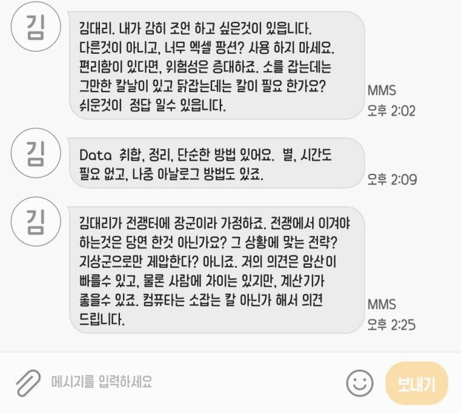

# 팡션? 사용하지 마세요.

## 차례

1. [명령형/객체지향 vs 함수형](docs/imperative-vs-functional.md)
   - 불변 데이터
   - 디자인 패턴
2. [함수](docs/function.md)
3. [함수형 프로그래밍이 필요한 이유](docs/why-functional.md)
   - 고차 함수 [Higher-order Function](docs/high-order-function.md)
   - 느긋한 계산 [Lazy Evaluation](docs/lazy-evaluation.md)

---

---

## 복습

### 알맞을 때 사용한다.

> 김대리. 내가 감히 조언 하고 싶은것이 있읍니다. 다른것이 아니고, **너무 엑셀 팡션? 사용하지 마세요.** 편리함이 있다면, 위험성은 증대하죠. 소를 잡는데는 그만한 칼날이 있고 닭잡는데는 **칼이 필요 한가요?** **쉬운것이 정답 일수 있읍니다.**  

- 함수형 프로그래밍 패러다임은 인기가 많은 프로그래밍 언어에서도 이미 적용되어 있다.
- 함수형 프로그래밍은 **학습 곡선이 가파르다.**
- 함수형 프로그래밍은 **오랜 숙련이 필요하다.**

---

### 고차 함수의 합성 + 느긋한 계산

> **Data** **취합, 정리, 단순한 방법** 있어요.  

- OOP의 복잡한 디자인 패턴은 **일급**으로 다루어지는 **고차 함수들의 합성**으로 구현 가능하다.
- 익명 함수, 커링 등 다양한 개념이 적용되어 **재사용성**, **모듈화**, **사용 편이성** 수준이 높아진다.

#### 데이터

- 값, 결과물

#### 계산

> 별, **시간도 필요 없고**, **나중** 아날로그 방법도 있죠.

- 순수 함수 pure function
- 같은 입력값을 넣으면 항상 똑같은 결과값이 나온다: [절차형 vs 함수형](docs/imperative-vs-functional.md)
- **언제든지** 마음껏 실행할 수 있다.: **[나중에 계산하기](docs/lazy-evaluation.md)**
- 테스트하기 쉽다.

#### 액션

- [부수 효과 side-effect](docs/side-effect.md)가 있는 *순수하지 않은 함수 impure function*
- **상황에 따라 실행 결과가 달라진다.**
- 다루기 어렵다. (테스트가 어렵다.)

##### 부수 효과 side-effect

- 부수 효과는 잠재적으로 복잡한 코드가 숨어있다는 뜻이다.
- 숨어있는 복잡한 코드에서 버그가 발생할 가능성이 많아진다.
- 부수 효과를 **줄인다면** 안정성을 높일 수 있다. → **순수 함수**
- 부수 효과를 **표면적으로 드러내는 방법**으로도 안정성을 높일 수 있다. → 명시적인 함수 정의 / 타입 시스템 활용

---

### 최적화 전략

> 김대리가 전쟁터에 장군이라 가정하죠. 전쟁에서 이겨야 하는것은 당연 한것 아닌가요? **그 상황에 맟는 전략?** 지상군으로만 제압한다? 아니죠. 저의 의견은 암산이 빠를수 있고, 물론 **사람에 차이**는 있지만, 계산기가 좋을수 있죠. 컴퓨타는 소잡는 칼 아닌가 해서 의견 드립니다.  

- 각 언어마다 특성, 장단점을 정확하게 알아야 한다.
  - 함수형 언어들도 저마다 다른 목표를 가지고 있다.
- 상황에 따라 적합하게 선택해야 한다.
  - 프로젝트의 목표
  - 가용한 자원: 컴퓨팅, 시간, 사람
  - 개발자 인재풀
  - 전체 시스템 설계

---

## 결론

함수형 프로그래밍을 적용하게 된다면:
- **자연스럽게** 재사용성이 높은 함수를 설계하게 된다.
- **결국에는**, 프로그램의 **품질**과 **견고성**이 **향상될 것이다.**

---

## 참고

- Paper
  - [Why Functional Programming Matters](https://www.cs.kent.ac.uk/people/staff/dat/miranda/whyfp90.pdf) by John Hughes. 1990.
- Read
  - [Why functional programming should be the future of software development](https://spectrum.ieee.org/functional-programming)
  - [Data Oriented Design과 Cache Miss](http://rapapa.net/?p=2792)
  - [어떤 프로그래밍 언어들이 함수형인가?](https://medium.com/@jooyunghan/%EC%96%B4%EB%96%A4-%ED%94%84%EB%A1%9C%EA%B7%B8%EB%9E%98%EB%B0%8D-%EC%96%B8%EC%96%B4%EB%93%A4%EC%9D%B4-%ED%95%A8%EC%88%98%ED%98%95%EC%9D%B8%EA%B0%80-fec1e941c47f)
  - [함수형 프로그래밍이란 무엇인가?](https://medium.com/@jooyunghan/%ED%95%A8%EC%88%98%ED%98%95-%ED%94%84%EB%A1%9C%EA%B7%B8%EB%9E%98%EB%B0%8D%EC%9D%B4%EB%9E%80-%EB%AC%B4%EC%97%87%EC%9D%B8%EA%B0%80-fab4e960d263)
  - [SOLID principles in Functional Programming](https://medium.com/@mkocik/solid-principles-in-functional-programming-b9b83aeddf80)
- Book
  - [Grokking Simplicity](https://www.manning.com/books/grokking-simplicity?query=grokking) by Eric Normand
  - [쏙쏙 들어오는 함수형 코딩](https://jpub.tistory.com/1265)
  - [Data Oriented Design](https://www.dataorienteddesign.com/dodbook)
  - [Learn you a haskell](http://learnyouahaskell.com/higher-order-functions)
  - [Functional Thinking](https://nealford.com/books/functionalthinking.html)
- Video
  - [Why Functional Programming Matters](https://youtu.be/XrNdvWqxBvA)
  - [FP vs OOP: Choose Two](https://youtu.be/HSk5fdKbd3o) by Brian Goetz
  - [Why Isn't Functional Programming the Norm?](https://youtu.be/QyJZzq0v7Z4) by Richard Feldman
  - [Repl Driven Development](https://vimeo.com/223309989) by Chicago Clojure
  - [Functional Design Patterns](https://youtu.be/srQt1NAHYC0) by Scott Wlaschin
  - [Lazy Data-Oriented Evaluation Strategies](https://youtu.be/Y9XEbl9bqts)
  - [OOP Is Dead, Long Live Data-oriented Design](https://youtu.be/yy8jQgmhbAU)
  - Let’s Get Lazy - [The Real Power of Functional Programming](https://youtu.be/ntWdmlrCheY)
  - [On the Spectrum of Abstraction](https://youtu.be/mVVNJKv9esE)
- Other
  - [Computer Languages History](https://www.levenez.com/lang/lang.pdf)
  - Dev Dive 함수형 개발자로 성장하기. Greenlabs. 2022.
