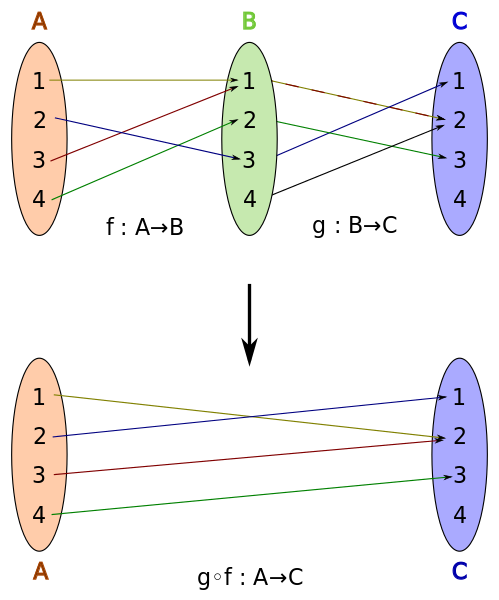

# 함수

**함수는 이미 익숙하다**: 중학교 1학년 1학기 - IV. 좌표평면과 그래프

---

### 간단한 함수

| 수학 함수                                                       | 좌표 평면과 그래프                                          |
| --------------------------------------------------------------- | ----------------------------------------------------------- |
|  |  |

```c
float y = 1 / sqrt(x);
```

<details>
    <summary>다른 방법?</summary>

<br>

- [Fast Inverse Square Root](https://en.wikipedia.org/wiki/Fast_inverse_square_root)
- [고속 역제곱근](https://seunghoonlp.github.io/2020/08/29/fast-inverse-sqrt/)
- YouTube: [A Quake III Algorithm](https://youtu.be/p8u_k2LIZyo)
- source code: [Quake-III-Arena/code/game/q_math.c](https://github.com/id-Software/Quake-III-Arena/blob/master/code/game/q_math.c#L552-L572)

```cpp
float Q_rsqrt( float number )
{
  long i;
  float x2, y;
  const float threehalfs = 1.5F;

  x2 = number * 0.5F;
  y  = number;
  i  = * ( long * ) &y;                          // evil floating point bit level hacking
  i  = 0x5f3759df - ( i >> 1 );                  // what the fuck?
  y  = * ( float * ) &i;
  y  = y * ( threehalfs - ( x2 * y * y ) );      // 1st iteration
//  y  = y * ( threehalfs - ( x2 * y * y ) );    // 2nd iteration, this can be removed

  return y;
}
```
</details>


### 미분 함수

|        | 함수                     |
| ------ | ------------------------ |
| 함수   |     |
| 도함수 |  |


```Matlab
syms x r
f = x .^ r

g = diff(f)
% ans = r * x .^ (r-1)

subs(g, [x, r], [3, 2])
% ans = 6
```

`도함수 = 미분함수(함수)`

---

## 함수의 합성: 분해와 조립

| 함수 합성                                                                                                                                                                   | 새로운 함수                                                                                                                                                                                                                  |
| --------------------------------------------------------------------------------------------------------------------------------------------------------------------------- | ---------------------------------------------------------------------------------------------------------------------------------------------------------------------------------------------------------------------------- |
|  |  |

```c
int f(int x) { return x * x; }
int g(int x) { return x + 1; }

g(f(3)); // 10
```
