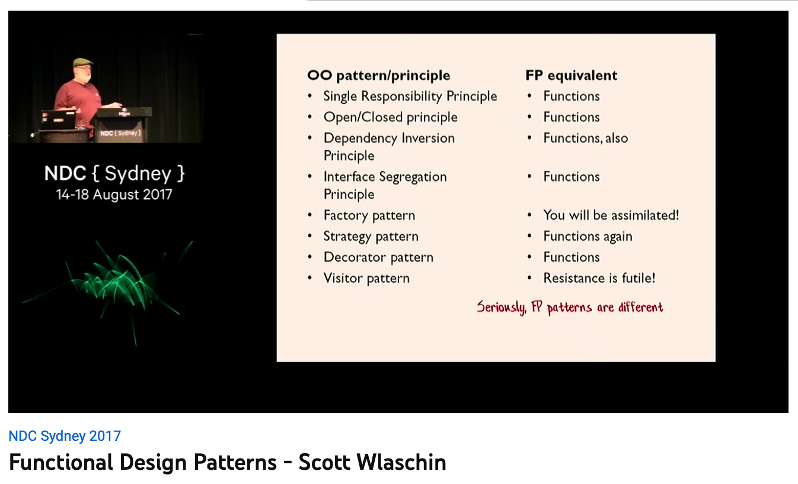

# 명령형 vs 함수형

| 명령형 프로그래밍 | 함수형 프로그래밍 |
| ----------------- | ----------------- |
| 5 + 2 = 7         | 5 + 2 = 7         |
| 5 + 3 = **10**    | 5 + 3 = **8**     |
| 5 + 4 = **14**    | 5 + 4 = **9**     |

---

## 명령형 프로그래밍

[imperative.c](../src/imperative-vs-functional/imperative.c)

```c
int x = 5; // x = 5

x += 2;    // x + 2 = 7
x += 3;    // x + 3 = 10
x += 4;    // x + 4 = 14
```

- 변수의 상태가 변경된다.

---

## 함수형 프로그래밍

[functional.py](../src/imperative-vs-functional/functional.py)

```py
>>> def add(a, b):
...   return a + b
...
>>> a = 5
>>> add(a, 2)
7
>>> add(a, 3)
8
>>> add(a, 4)
9
```

- 같은 입력값을 넣으면 항상 똑같은 결과값이 나온다.
- **언제든지** 마음껏 **실행할 수 있다.**
- 테스트하기 쉽다.

---

## 디자인 패턴


- [Functional Design Patterns](https://youtu.be/srQt1NAHYC0) by Scott Wlaschin

객체지향 프로그래밍에서 자주 쓰던 **디자인 패턴은**  
함수형 프로그래밍에서 **사라진다.**

디자인 패턴 → 고차 함수의 합성

---

## Data Oriented Design

- Book: [Data Oriented Design](https://www.dataorienteddesign.com/dodbook)
- [Data Oriented Design과 Cache Miss](http://rapapa.net/?p=2792)